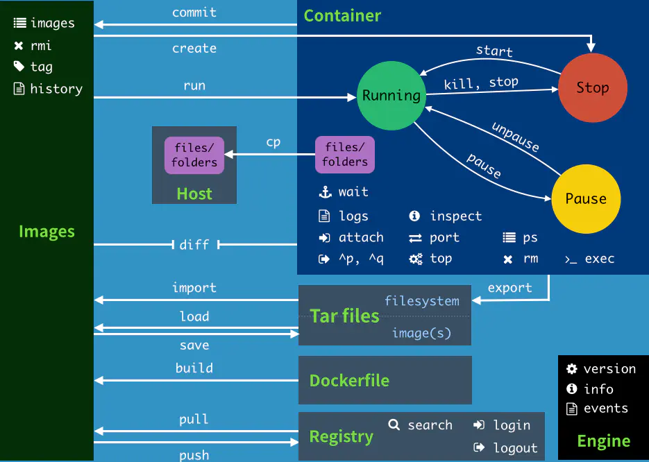

### 概述

> docker 是一款用来开发、部署、运行应用的虚拟化平台，跟虚拟机相比它不会虚拟一个完整的操作系统，而是直接运行在我们的宿主机上，容器没有自己的内核所以轻便很多。而且每个容器之间是相互隔离的有自己的文件系统，所以我们可以像使用集装箱一样去组合自己的应用。

### 优点

1. 比较轻便、可以秒级启动服务，节省开发与部署时间；
2. 方便运维，保证开发、测试、线上环境高度一致；
3. 高效利用计算机资源，可以在服务器上虚拟很多我们需要的各个版本的容器；
4. 交付更加方便，以前我们需要交付各种源码、程序包、部署文档，现在只需要交付一个`docker image`；

### 安装

#### `docker`的基本组成

> 镜像

类似于一个模板，可以使用镜像启动多个服务

> 容器

利用镜像启动的一个或一组服务叫做容器

> 仓库

存放镜像的远程仓库`dockerhub`，类似于`github` ，地址：[官网地址](https://hub.docker.com/)

#### 宿主环境

```shell
# 内核
# uname -r
5.4.0-48-generic

# 系统版本
# cat /etc/os-release 
NAME="Ubuntu"
VERSION="18.04.5 LTS (Bionic Beaver)"
ID=ubuntu
ID_LIKE=debian
PRETTY_NAME="Ubuntu 18.04.5 LTS"
VERSION_ID="18.04"
HOME_URL="https://www.ubuntu.com/"
SUPPORT_URL="https://help.ubuntu.com/"
BUG_REPORT_URL="https://bugs.launchpad.net/ubuntu/"
PRIVACY_POLICY_URL="https://www.ubuntu.com/legal/terms-and-policies/privacy-policy"
VERSION_CODENAME=bionic
UBUNTU_CODENAME=bionic
```

#### 安装命令

```shell
# 如有历史版本，先卸载
sudo apt-get remove docker docker-engine docker.io containerd runc
# 更新apt索引
sudo apt-get update
# 安装依赖包
sudo apt-get install \
    apt-transport-https \
    ca-certificates \
    curl \
    gnupg-agent \
    software-properties-common
# 添加 Docker 的官方 GPG 密钥：
curl -fsSL https://download.docker.com/linux/ubuntu/gpg | sudo apt-key add -
# 验证指纹
sudo apt-key fingerprint 0EBFCD88
# 给docker设置仓库地址<中国科技大学镜像仓库>
sudo add-apt-repository \
   "deb [arch=amd64] https://mirrors.ustc.edu.cn/docker-ce/linux/ubuntu/ \
  $(lsb_release -cs) \
  stable"
# 更新apt索引
sudo apt-get update
# 安装社区版的docker
sudo apt-get install docker-ce docker-ce-cli containerd.io
```

#### 查看docker版本信息

```shell
# docker version
Client: Docker Engine - Community
 Version:           19.03.13
 API version:       1.40
 Go version:        go1.13.15
 Git commit:        4484c46d9d
 Built:             Wed Sep 16 17:02:36 2020
 OS/Arch:           linux/amd64
 Experimental:      false

Server: Docker Engine - Community
 Engine:
  Version:          19.03.13
  API version:      1.40 (minimum version 1.12)
  Go version:       go1.13.15
  Git commit:       4484c46d9d
  Built:            Wed Sep 16 17:01:06 2020
  OS/Arch:          linux/amd64
  Experimental:     false
 containerd:
  Version:          1.3.7
  GitCommit:        8fba4e9a7d01810a393d5d25a3621dc101981175
 runc:
  Version:          1.0.0-rc10
  GitCommit:        dc9208a3303feef5b3839f4323d9beb36df0a9dd
 docker-init:
  Version:          0.18.0
  GitCommit:        fec3683
```

### 常用命令

#### 帮助命令

1. `docker version` 查看docker的版本信息
2. `docker info` docker的详细信息，包括容器数、镜像数、镜像地址等等
3. `docker [命令] --help` 查看某个命令的帮助文档

#### 镜像命令

> `docker search 镜像名` 搜索某个镜像  

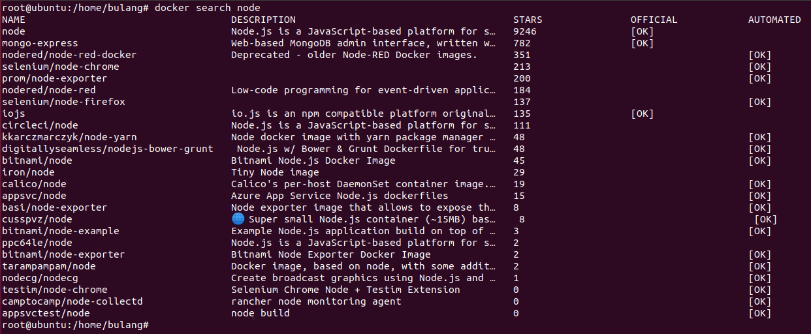

> `docker pull 镜像名` 从远程拉取某个镜像

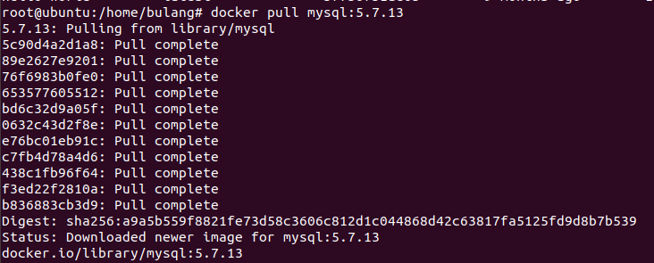

> `docker images` 列出所有已经下载到本地的镜像信息

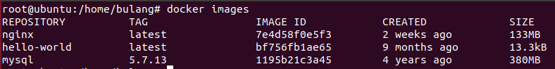

> `docker rmi name|ID` 删除某个镜像

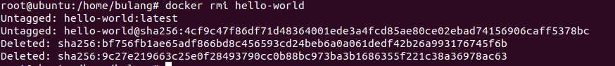

> 批量删除镜像

```shell
# 传值删除
docker rmi $(docker images -q)

# 利用管道符删除
docker images -q | xargs docker rmi
```

> `docker commit -m"镜像描述" -a"作者" containerID imageName:tag` 提交某个容器为镜像

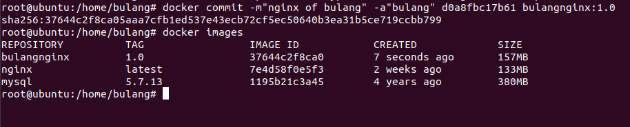

> `docker history 镜像id` 查看镜像的历史文件层信息

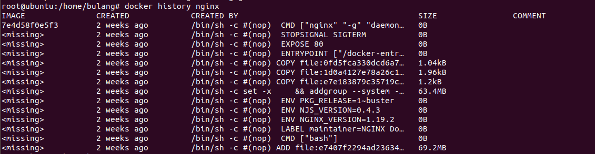

#### 容器命令

> `docker run [options] image` 指定镜像，启动一个容器

```shell
# options 常用参数说明
--name name # 指定容器的名字，当有多个镜像时方便区分
-it # 以交互的方式启动容器，启动后打开容器内的终端
-d # 在后台运行容器
-p 宿主机Port:容器Port # 小写p映射指定端口到容器开放的端口上
-P # 大写的P随机指定主机的映射端口
-v 宿主机的路径:容器内的路径 # 给容器挂载数据卷用来数据持久化（后面数据卷做详细描述）
```

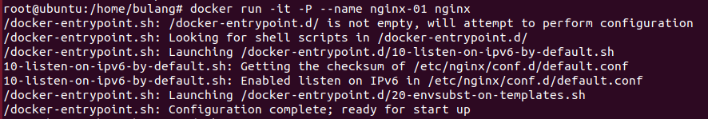

> 停止或启动容器

```shell
docker start 容器ID # 启动停止中的容器
docker restart 容器ID # 重启容器
docker stop 容器ID # 终止容器
docker kill 容器ID # 强行终止容器
docker pause 容器ID # 暂停容器
docker unpause 容器ID # 启动暂定的容器
```

> 查看容器

```shell
docker ps # 查看所有正在运行的容器
docker ps -a # 查看所有容器包括历史容器
docker ps -q # 只列出容器ID 可以跟-a一起使用 
docker ps -n=number # 列数最近启动的前number个容器
```

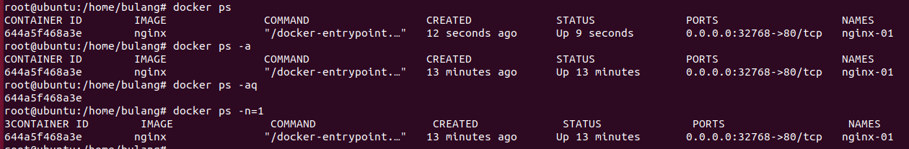

> `docker diff 容器ID` 查看容器变化

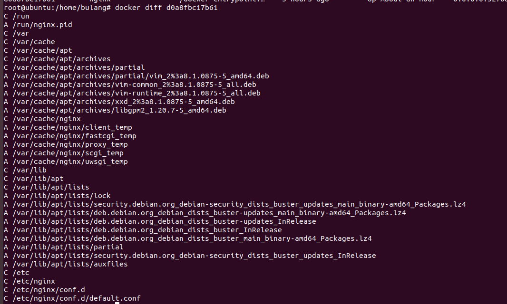

> 删除容器

```shell
docker rm -f 容器ID # 删除单个容器
docker rm -f $(docker ps -aq) # 删除所有容器包括历史容器，去掉-a只删除所有运行中的容器
docker ps -aq | xargs docker rm -f # 通过管道符删除容器跟上面的作用一样
```

> `docker top 容器ID` 查看容器中的进程信息

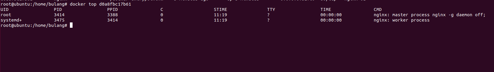

> 进入容器

```shell
docker exec -it 容器ID 默认命令行 # 进入容器并打开新的命令行
docker attach 容器ID # 进入容器并聚焦到正在运行的终端
```

> 退出容器

```shell
exit # 退出并停止容器
Ctrl + p + q # 退出不停止容器 
```

#### 其他命令

1. `docker logs -f -t --tail number 容器ID` 查看容器内的前number条日志
2. `docker inspect 容器ID|镜像ID` 查看容器或镜像的元数据
3. `docker cp 容器ID:容器内路径 主机路径` 拷贝容器内的文件到宿主机

### 容器数据卷

有些服务需要做数据持久化，比如`MySql`。还有的服务每次修改配置都得进入容器操作比较麻烦，所以我们需要给容器挂载数据卷，让容器内的数据时刻与宿主机的数据保持一致，这样容器删除之后我们的宿主机上还有保存的数据。

### `Dockerfile`

### Docker 网络

### 实战

